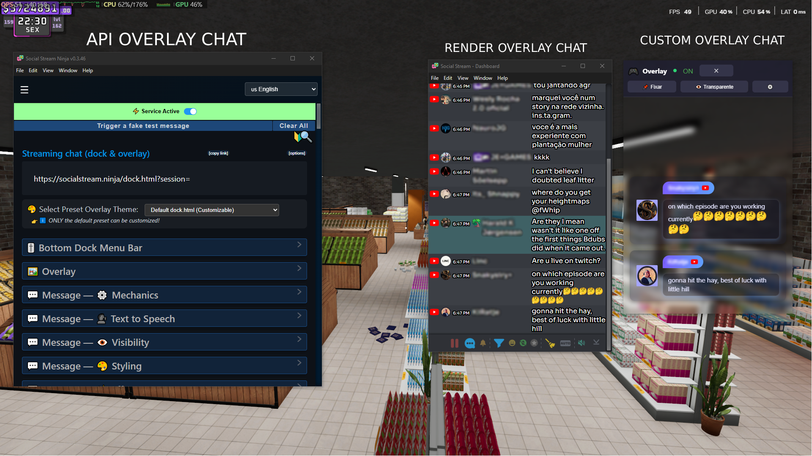

# StreamChat Overlay / Overlay de Chat

A modern and customizable chat overlay for streamers, integrated with **Social Stream Ninja**.
Um overlay de chat moderno e personalizável para streamers, integrado com o **Social Stream Ninja**.

---

## 📦 Project Structure / Estrutura do Projeto

```
StreamChat Overlay/
├── frontend/             # Frontend
│   ├── dist/             # Build output / Saída do build
│   │   ├── src/
│   │   │   ├── assets/
│   │   │   │   ├── chat/ # Chat theme / Tema do chat
│   │   │   │   │   ├── custom-theme.html
│   │   │   │   │   ├── chat.css
│   │   │   │   │   ├── chat.js
│   │   ├── main.js       # Main logic / Lógica principal
│   │   ├── style.css     # Styles / Estilos
│   ├── package.json      # Frontend dependencies / Dependências
│   └── index.html        # Main page / Página principal
├── app.go                # Backend logic / Backend
├── main.go               # App entry point / Ponto de entrada
├── wails.json            # Wails config / Configuração
└── README.md             # This file / Este arquivo
```

---

## ✨ Features / Funcionalidades

* **Social Stream Ninja integration** – Real-time chat / Integração com Social Stream Ninja
* **Modern design** – Clean interface / Design moderno
* **Audio alerts** – Beep on new messages / Alertas de áudio
* **Transparent mode** – Perfect for streaming / Modo transparente
* **Always on top** – Keep overlay visible / Janela sempre visível
* **Smooth animations** – Elegant transitions / Animações suaves

---

## 🛠️ Technologies / Tecnologias

* [Wails](https://wails.io/) – Desktop apps with Go + Web
* [Vite](https://vitejs.dev/) – Frontend build tool
* [Social Stream Ninja](https://socialstream.ninja/) – Chat aggregation platform

---

## 🚀 How to Use / Como Usar

1. Install Wails / Instale o Wails:

   ```sh
   go install github.com/wailsapp/wails/v2/cmd/wails@latest
   ```
2. Clone this repo / Clone o repositório
3. Run *`wails dev`*\* for live dev / Execute **`wails dev`** pa\*ra desenvolvimento
4. Run `wails build` for production / Execute `wails build` para produção

---

## ⚙️ Configuration / Configuração

1. Open settings ⚙️ / Abra configurações ⚙️
2. Enter your **Session ID** from Social Stream Ninja / Digite seu **Session ID** do Social Stream Ninja
3. Click **Connect** / Clique em **Conectar**

---

## 🎨 Customization / Personalização

* **Style / Estilo** → Edit `frontend/src/style.css`
* **Chat Theme / Tema do Chat** → `custom-theme.html`, `chat.css`, `chat.js`
* **Logic / Lógica** → `main.js`

---

## 📌 Overlay Chat Comparison

Essa imagem mostra três tipos de **overlay de chat** usados em transmissões ao vivo ou jogos:




### 1. **API Overlay Chat** (esquerda)
- Usa integração via **API/Web** (no exemplo, Social Stream Ninja).  
- Permite copiar um link (`dock.html`) e customizar temas de overlay.  
- Configurações extras: dock, menu, TTS, visibilidade e estilização.  

### 2. **Render Overlay Chat** (meio)
- Mostra o chat sendo **renderizado diretamente** pelo software.  
- Exibe mensagens em tempo real com ícones de plataformas (ex.: YouTube).  
- Interface parecida com um painel de dashboard, mas visível em overlay.  

### 3. **Custom Overlay Chat** (direita)
- Overlay **personalizado** feito pelo usuário.  
- Opções de fixar, deixar transparente e estilizar mensagens.  
- Design mais moderno, com avatar, nome, mensagem e ícones das plataformas.  

---

📷 **Resumo da Imagem:**  
A tela ilustra a diferença entre usar um **overlay padrão via API**, um **overlay renderizado pelo app** e um **overlay customizado**, todos aplicados em jogos ou transmissões, para melhorar a interação do chat na tela.


---

## 📄 License / Licença

MIT
